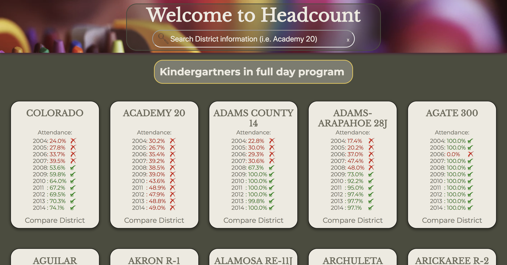
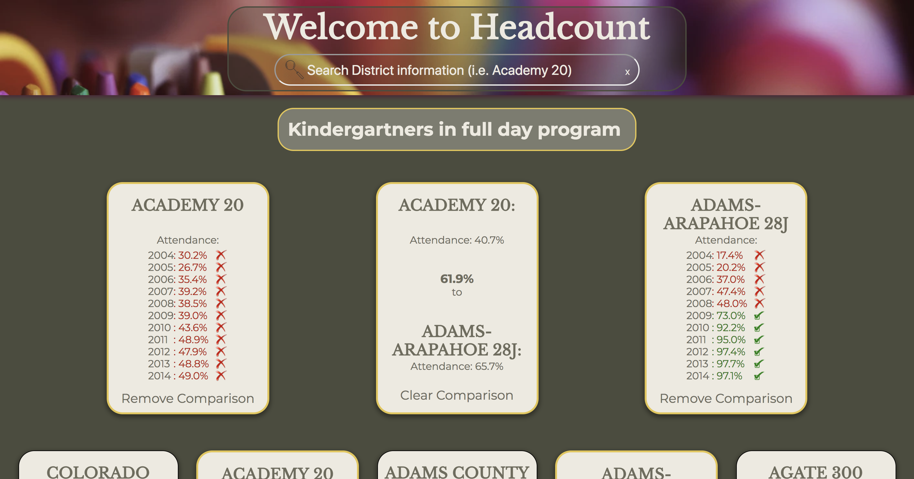

## HeadCount 2.0

An application used to present Colorado school district information organized by each district, built with React, Javascript, and CSS.

## Team

Matt Walker
Pat McLaughlin

## Project Status

This project is currently the minimum viable product. Users can view the percentage of kindergartners attending full day programs in each Colorado school district, as well as select two districts to compare to one another. Functionality to present additional district information is in progess.

## Project Screen Shots

## Installation and Setup Instructions

Clone down this repository. You will need `node` and `npm` installed globally on your machine.  

Installation:

`npm install`  

To Run Test Suite:  

`npm test`  

To Start Server:

`npm start`  

To Visit App:

`localhost:3000`

## Reflection

This was a one week project during Module Three of the front end program at Turing. Project goals included manipulation of data as well as creating small, reusable React Components. Additionally, we were to use jest/enzyme to build a thorough testing suite to help guide us during app development.

We set out to build an app that would take in a state's school district information(in this app, we use mock data pulled from Colorado schools), and allow a user to view statistics related to their district, and compare to other districts. 

One of the main challenges was our implementation of handling the comparison of district information. We went through several refactors before settling on our current implementation. Additionally, due to time constraints, we opted to spend our remaining time polishing up our existing code base, rather than trying for an extension and possibly leaving ourselves open to having code uncovered by our testing suite, and code lacking readability.

Technologies used to to implement this project were React, JSX, vanillaJS, and CSS, as well as Jest/Enzyme for the testing suite. The boilerplate repo used to build this app was constructed using `create-react-app`.